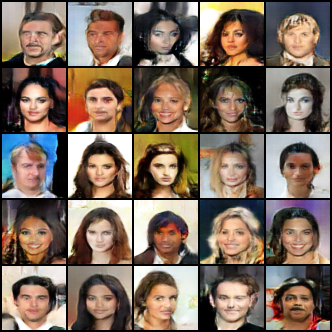

# Image Generative Modeling

Sandbox for implementing, experimenting, and testing different classes of image generation models. Implementations may be simplified or incomplete to better understand core ideas and trade-offs.

## Model Families

The following broad families of generative models are explored:

- adversarial 
- diffusion-based 
- autoregressive 
- variational 
- flow-based 

## Datasets

The following datasets are used:

- [CelebA](https://docs.pytorch.org/vision/main/generated/torchvision.datasets.CelebA.html)
- [CelebA-HQ](https://www.kaggle.com/datasets/badasstechie/celebahq-resized-256x256)

## Results

<table>
  <tr>
    <th>Model</th>
    <th>Training Progress</th>
    <th>Cherrypicked Samples</th>
  </tr>
  <tr>
    <td><b><a href="https://doi.org/10.48550/arXiv.1511.06434" target="_blank"> DCGAN </a></b></td>
    <td></td>
    <td></td>
  </tr>

  <tr>
    <td><b><a href="https://doi.org/10.48550/arXiv.1704.00028" target="_blank"> WGAN-GP </a></b></td>
    <td>coming soon...</td>
    <td>coming soon...</td>
  </tr>
</table>

